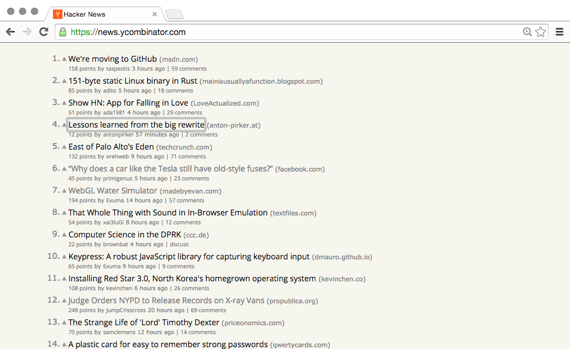

# HackerNews for Power Users #

Strip away everything from HN except the links.

Use `j/k` to navigate links, enter to open. `c` opens the comments of a link. You can use tab for finer control.

## note ##

My default font is Open Sans, which I like more than HN's font (Geneva), so this extension uses you system default font. I really recommend you use that instead of Times New Roman, download it [here](http://www.google.com/fonts/specimen/Open+Sans) (scroll to the bottome of the page and click `Open Sans in Google Fonts »`, then click the down arrow in the top right. Set it as your default font in `Settings --> Show advanced settings... --> Web Content --> Customize Fonts`.

## todo ##

- add Open Sans into the extension
